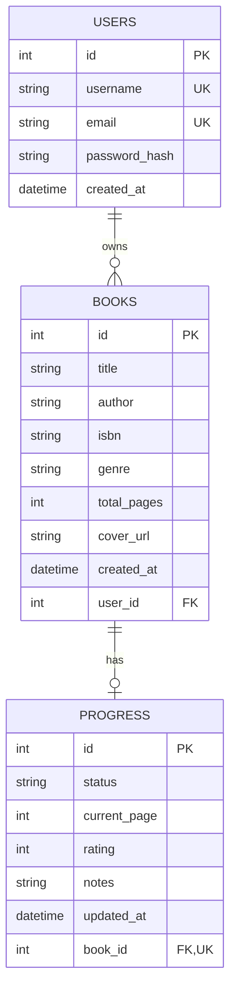

# Book Tracker App (SQRS S26)


Book Tracker is a FastAPI + Streamlit application for personal reading management.
It supports authentication, book CRUD, reading progress tracking, filtering/search, and Open Library integration.

This repository is built for Software Quality, Reliability, and Security (SQRS) and includes:

- layered automated tests (unit, integration, E2E)
- schema and business validation checks
- static quality gates (lint, security, complexity)
- Locust performance testing and reporting

## 1. Quick Start

### Prerequisites

- Python 3.11+
- Poetry

### Install dependencies

```bash
poetry install
```

### Run the API (FastAPI)

```bash
poetry run uvicorn src.main:app --reload --host 127.0.0.1 --port 8000
```

API docs:

- Swagger UI: http://127.0.0.1:8000/docs
- OpenAPI JSON: http://127.0.0.1:8000/openapi.json

### Run Streamlit

Use the root entrypoint:

```bash
poetry run streamlit run streamlit_app.py
```

Or run the frontend entry module directly:

```bash
poetry run streamlit run frontend/app.py
```

Optional theme scripts:

```powershell
./scripts/run_frontend_light.ps1
./scripts/run_frontend_dark.ps1
```

## 2. Testing Commands

### Full test suite

```bash
poetry run pytest -q
```

Expected output (current run):

```text
170 passed
```

### Coverage gate

```bash
poetry run pytest --cov=src --cov-fail-under=70 --cov-report=xml
```

Expected output (current run):

```text
Required test coverage of 70% reached. Total coverage: 94.51%
170 passed
```

## 3. Quality Tooling Commands

### flake8

```bash
poetry run flake8 src tests frontend
```

Expected output (current run):

```text
Exit code 1.
Current repository state reports style violations in tests (for example: W292, W293, E302, E303, E501).
```

### bandit

```bash
poetry run bandit -r src
```

Expected output (current run):

```text
Exit code 1.
1 Low-severity finding (B105 hardcoded_password_string) in src/routers/auth.py.
```

### radon

```bash
poetry run radon cc src -a
```

Expected output (current run):

```text
Average complexity: A (2.581818181818182)
```

### locust

Start API in one terminal, then run load test in another terminal:

```bash
poetry run locust -f locustfile.py --host http://127.0.0.1:8000 --headless -u 50 -r 10 -t 1m --html docs/locust_report.html
```

Expected output:

```text
Headless run summary with request statistics and failures.
HTML report generated at docs/locust_report.html.
```

## 4. Quality Metrics (Verified)

The values below are from actual runs/artifacts in this repository:

- Coverage: 94.51%
- Radon average grade: A (2.5818)
- Bandit findings: 1 Low (B105), 0 Medium, 0 High
- Locust P95 (aggregated): 130 ms (from docs/locust_report.html)

## 5. API Documentation Completeness

All API endpoints now include both summary and description metadata visible in /docs.
Router handlers were updated with explicit summaries/descriptions and docstrings across:

- auth routes
- books routes
- progress routes
- openlibrary routes

OpenAPI verification result:

```text
missing_count= 0
total_ops= 12
```

## 6. Database Model

The persistence layer is defined with SQLAlchemy ORM models in [src/models.py](src/models.py).



| Table | Key fields | Constraints | Relationships |
| --- | --- | --- | --- |
| `users` | `id`, `username`, `email`, `password_hash`, `created_at` | `username` and `email` are unique and required | One user owns many books |
| `books` | `id`, `title`, `author`, `isbn`, `genre`, `total_pages`, `cover_url`, `created_at`, `user_id` | `total_pages` is null or non-negative | Each book belongs to one user and has at most one progress row |
| `progress` | `id`, `status`, `current_page`, `rating`, `notes`, `updated_at`, `book_id` | `rating` is 1-5, `current_page` is non-negative, `status` is one of `not_started`, `reading`, `completed` | One progress row belongs to exactly one book |

### User

- Table: `users`
- Fields: `id`, `username`, `email`, `password_hash`, `created_at`
- Constraints: `username` and `email` are unique and required
- Relationship: one user owns many books through `books`

### Book

- Table: `books`
- Fields: `id`, `title`, `author`, `isbn`, `genre`, `total_pages`, `cover_url`, `created_at`, `user_id`
- Constraints: `total_pages` must be null or non-negative
- Relationship: each book belongs to one user and has at most one progress record

### Progress

- Table: `progress`
- Fields: `id`, `status`, `current_page`, `rating`, `notes`, `updated_at`, `book_id`
- Constraints: `rating` is limited to 1 through 5, `current_page` must be non-negative, and `status` must be one of `not_started`, `reading`, or `completed`
- Relationship: one progress row is linked to exactly one book

The `books` and `progress` tables are configured with cascading deletes so related rows are removed when a parent record is deleted.

## 7. Testing Documentation

## 7.1 Overview

The Book Tracker App uses a multi-layered testing strategy designed to verify correctness, reliability, isolation, validation rules, API behavior, and quality gate compliance.

The suite is built around these principles:

- business logic tested at service level with unit tests
- HTTP behavior tested through FastAPI TestClient
- full user flows tested end-to-end
- external API integration tested with mocks
- search logic stress-tested with property-based testing
- performance validated separately with Locust
- all tests run against an isolated test database

## 7.2 Testing Goals

- Functional correctness for auth, books, progress, search, and Open Library integration
- Security correctness for authenticated access and user isolation
- Validation correctness at schema, service, and API layers
- Data integrity (uniqueness, cascade delete, one-to-one progress relationship)
- Behavior consistency (derived status, nested response structures)
- CI quality readiness with stable reproducible test runs

## 7.3 Testing Stack

- Pytest
- FastAPI TestClient
- SQLite in-memory test database
- Hypothesis
- pytest-cov
- Locust
- monkeypatch/mocking for Open Library

## 7.4 Test Suite Structure

### Unit tests

Location:

```text
tests/unit/
```

Files:

- tests/unit/test_auth.py
- tests/unit/test_books.py
- tests/unit/test_openlibrary.py
- tests/unit/test_progress.py
- tests/unit/test_search.py

Focus:

- service-layer logic
- schema validation behavior
- business rules and helper logic
- Open Library mapping/parsing behavior without route execution

### Integration tests

Location:

```text
tests/integration/
```

Files:

- tests/integration/test_api.py
- tests/integration/test_auth_api.py
- tests/integration/test_books_api.py
- tests/integration/test_e2e.py
- tests/integration/test_openlibrary_api.py
- tests/integration/test_progress_api.py
- tests/integration/test_search_api.py

Focus:

- real API route behavior
- auth headers and route protection
- response status codes and payload contracts
- request validation and ownership isolation

### Shared infrastructure

Location:

```text
tests/conftest.py
```

Provides:

- isolated test DB engine and lifecycle
- function-scoped DB sessions
- dependency override for get_db
- function-scoped TestClient
- stable JWT secret in test environment

## 6.5 Environment Isolation

- tests never use production/development books.db
- per-test transactions are rolled back
- test data does not leak across tests
- API tests use overridden DB dependency for deterministic behavior

## 6.6 Coverage by Component

- Auth: registration/login uniqueness and JWT claim checks
- Books: CRUD, duplicate ISBN per-user, ownership, cascade delete
- Progress: creation/update rules, status derivation, rating/page validation
- Search: filtering, sorting, robustness against malformed input, user isolation
- Open Library: success/empty/error mappings with network failures mocked
- Schemas: direct Pydantic validation and ORM serialization checks

## 6.7 Property-Based Testing

Property-based cases in tests/unit/test_search.py validate invariants such as:

- no crashes for arbitrary query text
- return type stability
- safe behavior for malformed/adversarial inputs

## 6.8 Performance Testing

Performance testing is defined in:

```text
locustfile.py
```

A previous successful local run produced:

- zero failures
- authenticated traffic against API flows
- report artifact: docs/locust_report.html

## 6.9 External API Testing Strategy

Open Library tests mock httpx calls to cover:

- successful responses
- timeouts and connection failures
- malformed JSON
- upstream HTTP error conversion

Benefits:

- deterministic CI behavior
- no internet dependency
- full edge-case coverage control

## 6.10 Security and Validation Strategy

- protected route checks (401 without auth)
- invalid token rejection
- strict user isolation across reads/updates/deletes
- layered validation:
	schema-level (ValidationError), service-level (HTTPException), API-level (422)

## 6.11 CI Quality Gates

The pipeline uses:

- flake8
- bandit
- radon
- pytest with coverage gate

Core CI coverage command:

```bash
pytest --cov=src --cov-fail-under=70 --cov-report=xml
```

## 6.12 Current Strengths

- clear separation of unit/integration/E2E
- robust isolated test DB strategy
- realistic API-level assertions
- ownership/security behavior thoroughly tested
- property-based testing for search robustness
- performance checks available via Locust

## 6.13 Known Limitations

- SQLite-specific behavior may differ from other RDBMS
- migration testing is not present (create_all-based setup)
- live upstream Open Library behavior is not tested in CI (mocked by design)

## 6.14 Requirement Traceability (Summary)

- Unit business logic and validation: tests/unit/* + tests/test_schemas.py
- E2E workflow coverage: tests/integration/test_e2e.py
- Auth register/login flow: tests/integration/test_auth_api.py + E2E
- Book lifecycle and progress behavior: books/progress integration + E2E
- Filtering/search behavior: search unit/integration + E2E
- User data isolation: books/progress/search integration + E2E
- External API integration behavior: openlibrary unit/integration tests

## 7. Useful Development Commands

```bash
poetry run pytest
poetry run pytest -q
poetry run flake8 src tests frontend
poetry run bandit -r src
poetry run radon cc src -a
poetry run streamlit run streamlit_app.py
poetry run uvicorn src.main:app --reload
```

## 8. Optional Export

If a pip-compatible export is required:

```bash
poetry export -f requirements.txt --output requirements.txt --without-hashes
```
